# Revamped School Management System Database Schema

This schema is designed for Laravel and MySQL 8. It separates authentication, staff and student profiles, academic structure, enrollment, applications, RFID, attendance, and academic grading while preserving historical records.

## Legend

| Marker | Meaning |
|---|---|
| `PK` | Primary key |
| `FK` | Foreign key |
| `UK` | Unique key |
| `NULL` | Optional column |
| `1 : N` | One-to-many relationship |
| `1 : 1` | One-to-one relationship |
| `N : N` | Many-to-many relationship implemented through a junction table |

All `id` and foreign-key columns use `BIGINT UNSIGNED`, matching Laravel's `id()` and `foreignId()` methods. All timestamps are stored in UTC and presented in the `Asia/Manila` timezone.

## Entity relationship diagram

```mermaid
erDiagram
    USERS {
        BIGINT id PK
        CHAR public_id UK
        VARCHAR username UK
        VARCHAR email UK
        TIMESTAMP email_verified_at
        VARCHAR password
        VARCHAR role
        BOOLEAN is_active
        TIMESTAMP last_login_at
        TIMESTAMP password_changed_at
        VARCHAR remember_token
        TIMESTAMP created_at
        TIMESTAMP updated_at
        TIMESTAMP deleted_at
    }

    STAFF_PROFILES {
        BIGINT id PK
        BIGINT user_id FK,UK
        VARCHAR staff_no UK
        VARCHAR first_name
        VARCHAR middle_name
        VARCHAR last_name
        VARCHAR suffix
        DATE birth_date
        VARCHAR gender
        VARCHAR mobile
        TEXT address
        BIGINT department_id FK
        BIGINT position_id FK
        VARCHAR photo_path
        VARCHAR employment_status
        DATE hire_date
        TIMESTAMP created_at
        TIMESTAMP updated_at
        TIMESTAMP deleted_at
    }

    POSITIONS {
        BIGINT id PK
        VARCHAR code UK
        VARCHAR name UK
        TEXT description
        BOOLEAN is_active
        TIMESTAMP created_at
        TIMESTAMP updated_at
    }

    DEPARTMENTS {
        BIGINT id PK
        VARCHAR code UK
        VARCHAR name UK
        TEXT description
        BOOLEAN is_active
        TIMESTAMP created_at
        TIMESTAMP updated_at
        TIMESTAMP deleted_at
    }

    SCHOOL_YEARS {
        BIGINT id PK
        VARCHAR name UK
        DATE starts_on
        DATE ends_on
        DATE enrollment_starts_on
        DATE enrollment_ends_on
        BOOLEAN is_current
        VARCHAR status
        TIMESTAMP created_at
        TIMESTAMP updated_at
    }

    GRADE_LEVELS {
        BIGINT id PK
        BIGINT department_id FK
        VARCHAR code UK
        VARCHAR name
        SMALLINT sort_order
        BOOLEAN is_active
        TIMESTAMP created_at
        TIMESTAMP updated_at
        TIMESTAMP deleted_at
    }

    SECTIONS {
        BIGINT id PK
        CHAR public_id UK
        BIGINT school_year_id FK
        BIGINT grade_level_id FK
        VARCHAR name
        SMALLINT capacity
        VARCHAR room
        VARCHAR status
        TIMESTAMP created_at
        TIMESTAMP updated_at
        TIMESTAMP deleted_at
    }

    TEACHERS {
        BIGINT id PK
        CHAR public_id UK
        BIGINT user_id FK,UK
        VARCHAR teacher_no UK
        BIGINT department_id FK
        VARCHAR first_name
        VARCHAR middle_name
        VARCHAR last_name
        VARCHAR suffix
        DATE birth_date
        VARCHAR gender
        VARCHAR email
        VARCHAR mobile
        TEXT address
        VARCHAR position
        DATE hire_date
        VARCHAR photo_path
        VARCHAR status
        TIMESTAMP created_at
        TIMESTAMP updated_at
        TIMESTAMP deleted_at
    }

    SECTION_TEACHERS {
        BIGINT id PK
        BIGINT section_id FK
        BIGINT teacher_id FK
        VARCHAR assignment_type
        DATE assigned_on
        DATE ended_on
        BIGINT created_by FK
        TIMESTAMP created_at
        TIMESTAMP updated_at
    }

    APPLICATIONS {
        BIGINT id PK
        CHAR public_id UK
        VARCHAR application_no UK
        BIGINT school_year_id FK
        BIGINT grade_level_id FK
        VARCHAR first_name
        VARCHAR middle_name
        VARCHAR last_name
        VARCHAR suffix
        DATE birth_date
        VARCHAR gender
        VARCHAR lrn
        VARCHAR previous_school
        VARCHAR email
        VARCHAR mobile
        TEXT home_address
        VARCHAR guardian_name
        VARCHAR guardian_relationship
        VARCHAR guardian_contact
        VARCHAR guardian_email
        VARCHAR strand
        VARCHAR program
        VARCHAR status
        TIMESTAMP submitted_at
        TIMESTAMP verified_at
        TIMESTAMP approved_at
        TIMESTAMP created_at
        TIMESTAMP updated_at
        TIMESTAMP deleted_at
    }

    APPLICATION_DOCUMENTS {
        BIGINT id PK
        BIGINT application_id FK
        VARCHAR document_type
        VARCHAR original_name
        VARCHAR storage_path
        VARCHAR mime_type
        BIGINT size_bytes
        CHAR sha256
        VARCHAR review_status
        BIGINT reviewed_by FK
        TIMESTAMP reviewed_at
        TEXT review_notes
        TIMESTAMP created_at
        TIMESTAMP updated_at
    }

    APPLICATION_STATUS_HISTORY {
        BIGINT id PK
        BIGINT application_id FK
        VARCHAR from_status
        VARCHAR to_status
        BIGINT changed_by FK
        TEXT remarks
        TIMESTAMP changed_at
    }

    STUDENTS {
        BIGINT id PK
        CHAR public_id UK
        BIGINT user_id FK,UK
        BIGINT source_application_id FK,UK
        VARCHAR student_no UK
        VARCHAR lrn UK
        VARCHAR first_name
        VARCHAR middle_name
        VARCHAR last_name
        VARCHAR suffix
        DATE birth_date
        VARCHAR gender
        VARCHAR email
        VARCHAR mobile
        TEXT address
        VARCHAR photo_path
        VARCHAR status
        TIMESTAMP created_at
        TIMESTAMP updated_at
        TIMESTAMP deleted_at
    }

    GUARDIANS {
        BIGINT id PK
        CHAR public_id UK
        VARCHAR first_name
        VARCHAR middle_name
        VARCHAR last_name
        VARCHAR suffix
        VARCHAR email
        VARCHAR mobile
        VARCHAR alternate_mobile
        TEXT address
        TIMESTAMP created_at
        TIMESTAMP updated_at
        TIMESTAMP deleted_at
    }

    STUDENT_GUARDIANS {
        BIGINT id PK
        BIGINT student_id FK
        BIGINT guardian_id FK
        VARCHAR relationship
        BOOLEAN is_primary
        BOOLEAN is_emergency_contact
        BOOLEAN can_pick_up
        BOOLEAN has_consent_authority
        TIMESTAMP created_at
        TIMESTAMP updated_at
    }

    STUDENT_DOCUMENTS {
        BIGINT id PK
        BIGINT student_id FK
        VARCHAR document_type
        VARCHAR original_name
        VARCHAR storage_path
        VARCHAR mime_type
        BIGINT size_bytes
        CHAR sha256
        VARCHAR verification_status
        BIGINT verified_by FK
        TIMESTAMP verified_at
        TEXT notes
        TIMESTAMP created_at
        TIMESTAMP updated_at
        TIMESTAMP deleted_at
    }

    ENROLLMENTS {
        BIGINT id PK
        CHAR public_id UK
        VARCHAR enrollment_no UK
        BIGINT student_id FK
        BIGINT school_year_id FK
        BIGINT grade_level_id FK
        BIGINT section_id FK
        BIGINT application_id FK
        DATE enrolled_on
        VARCHAR status
        TEXT remarks
        BIGINT created_by FK
        TIMESTAMP created_at
        TIMESTAMP updated_at
        TIMESTAMP deleted_at
    }

    ENROLLMENT_STATUS_HISTORY {
        BIGINT id PK
        BIGINT enrollment_id FK
        VARCHAR from_status
        VARCHAR to_status
        BIGINT from_section_id FK
        BIGINT to_section_id FK
        BIGINT changed_by FK
        TEXT reason
        TIMESTAMP changed_at
    }

    RFID_CARDS {
        BIGINT id PK
        CHAR public_id UK
        VARCHAR uid UK
        VARCHAR status
        TIMESTAMP issued_at
        TEXT notes
        TIMESTAMP created_at
        TIMESTAMP updated_at
    }

    RFID_ASSIGNMENTS {
        BIGINT id PK
        BIGINT rfid_card_id FK
        BIGINT student_id FK
        BIGINT teacher_id FK
        BIGINT staff_profile_id FK
        BIGINT assigned_by FK
        TIMESTAMP starts_at
        TIMESTAMP ends_at
        VARCHAR end_reason
        TIMESTAMP created_at
        TIMESTAMP updated_at
    }

    RFID_DEVICES {
        BIGINT id PK
        CHAR public_id UK
        VARCHAR device_code UK
        VARCHAR name
        VARCHAR location
        VARCHAR secret_hash
        BOOLEAN is_active
        TIMESTAMP last_seen_at
        TIMESTAMP created_at
        TIMESTAMP updated_at
    }

    ATTENDANCE_RECORDS {
        BIGINT id PK
        BIGINT enrollment_id FK
        DATE attendance_date
        VARCHAR status
        TIMESTAMP first_time_in
        TIMESTAMP last_time_out
        VARCHAR source
        BIGINT recorded_by FK
        TEXT remarks
        TIMESTAMP created_at
        TIMESTAMP updated_at
    }

    RFID_SCAN_EVENTS {
        BIGINT id PK
        CHAR event_uuid UK
        BIGINT rfid_card_id FK
        BIGINT rfid_device_id FK
        BIGINT attendance_record_id FK
        BIGINT student_id FK
        BIGINT teacher_id FK
        BIGINT staff_profile_id FK
        VARCHAR scanned_uid
        DATETIME scanned_at
        TIMESTAMP received_at
        VARCHAR scan_type
        VARCHAR result
        VARCHAR error_message
        TIMESTAMP created_at
    }

    ATTENDANCE_CORRECTIONS {
        BIGINT id PK
        BIGINT attendance_record_id FK
        VARCHAR previous_status
        VARCHAR new_status
        TIMESTAMP previous_time_in
        TIMESTAMP new_time_in
        TIMESTAMP previous_time_out
        TIMESTAMP new_time_out
        TEXT reason
        BIGINT corrected_by FK
        TIMESTAMP created_at
    }

    SUBJECTS {
        BIGINT id PK
        VARCHAR code UK
        VARCHAR name
        TEXT description
        DECIMAL units
        BOOLEAN is_active
        TIMESTAMP created_at
        TIMESTAMP updated_at
        TIMESTAMP deleted_at
    }

    GRADING_PERIODS {
        BIGINT id PK
        BIGINT school_year_id FK
        VARCHAR name
        TINYINT sequence
        DATE starts_on
        DATE ends_on
        BOOLEAN is_locked
        TIMESTAMP created_at
        TIMESTAMP updated_at
    }

    CLASS_OFFERINGS {
        BIGINT id PK
        BIGINT section_id FK
        BIGINT subject_id FK
        BIGINT teacher_id FK
        VARCHAR status
        TIMESTAMP created_at
        TIMESTAMP updated_at
    }

    STUDENT_GRADES {
        BIGINT id PK
        BIGINT enrollment_id FK
        BIGINT class_offering_id FK
        BIGINT grading_period_id FK
        DECIMAL numeric_grade
        VARCHAR letter_grade
        VARCHAR remarks
        VARCHAR status
        BIGINT encoded_by FK
        BIGINT approved_by FK
        TIMESTAMP approved_at
        TIMESTAMP created_at
        TIMESTAMP updated_at
    }

    AUDIT_LOGS {
        BIGINT id PK
        BIGINT user_id FK
        VARCHAR action
        VARCHAR entity_type
        BIGINT entity_id
        JSON old_values
        JSON new_values
        VARCHAR ip_address
        TEXT user_agent
        CHAR request_id
        TIMESTAMP created_at
    }

    USERS ||--o| STAFF_PROFILES : "has staff profile"
    USERS ||--o| TEACHERS : "may authenticate"
    USERS ||--o| STUDENTS : "may authenticate"
    USERS ||--o{ AUDIT_LOGS : performs
    USERS ||--o{ APPLICATION_DOCUMENTS : reviews
    USERS ||--o{ APPLICATION_STATUS_HISTORY : changes
    USERS ||--o{ ENROLLMENTS : creates
    USERS ||--o{ ATTENDANCE_RECORDS : records
    USERS ||--o{ ATTENDANCE_CORRECTIONS : corrects
    USERS ||--o{ RFID_ASSIGNMENTS : assigns

    POSITIONS ||--o{ STAFF_PROFILES : classifies
    DEPARTMENTS ||--o{ STAFF_PROFILES : contains
    DEPARTMENTS ||--o{ TEACHERS : contains
    DEPARTMENTS ||--o{ GRADE_LEVELS : groups
    SCHOOL_YEARS ||--o{ SECTIONS : contains
    SCHOOL_YEARS ||--o{ APPLICATIONS : receives
    SCHOOL_YEARS ||--o{ ENROLLMENTS : contains
    SCHOOL_YEARS ||--o{ GRADING_PERIODS : divides
    GRADE_LEVELS ||--o{ SECTIONS : offers
    GRADE_LEVELS ||--o{ APPLICATIONS : requested_by
    GRADE_LEVELS ||--o{ ENROLLMENTS : places

    SECTIONS ||--o{ SECTION_TEACHERS : has
    TEACHERS ||--o{ SECTION_TEACHERS : assigned_to
    APPLICATIONS ||--o{ APPLICATION_DOCUMENTS : includes
    APPLICATIONS ||--o{ APPLICATION_STATUS_HISTORY : tracks
    APPLICATIONS ||--o| STUDENTS : becomes
    APPLICATIONS ||--o| ENROLLMENTS : produces
    STUDENTS ||--o{ STUDENT_GUARDIANS : has
    GUARDIANS ||--o{ STUDENT_GUARDIANS : supports
    STUDENTS ||--o{ STUDENT_DOCUMENTS : owns
    STUDENTS ||--o{ ENROLLMENTS : enrolls
    SECTIONS ||--o{ ENROLLMENTS : contains
    ENROLLMENTS ||--o{ ENROLLMENT_STATUS_HISTORY : tracks

    RFID_CARDS ||--o{ RFID_ASSIGNMENTS : assigned_through
    STUDENTS ||--o{ RFID_ASSIGNMENTS : may_own
    TEACHERS ||--o{ RFID_ASSIGNMENTS : may_own
    STAFF_PROFILES ||--o{ RFID_ASSIGNMENTS : may_own
    RFID_CARDS ||--o{ RFID_SCAN_EVENTS : scanned
    RFID_DEVICES ||--o{ RFID_SCAN_EVENTS : captures
    STUDENTS ||--o{ RFID_SCAN_EVENTS : resolved_as
    TEACHERS ||--o{ RFID_SCAN_EVENTS : resolved_as
    STAFF_PROFILES ||--o{ RFID_SCAN_EVENTS : resolved_as
    ENROLLMENTS ||--o{ ATTENDANCE_RECORDS : receives
    ATTENDANCE_RECORDS ||--o{ RFID_SCAN_EVENTS : supported_by
    ATTENDANCE_RECORDS ||--o{ ATTENDANCE_CORRECTIONS : corrected_by

    SECTIONS ||--o{ CLASS_OFFERINGS : schedules
    SUBJECTS ||--o{ CLASS_OFFERINGS : offered_as
    TEACHERS ||--o{ CLASS_OFFERINGS : teaches
    ENROLLMENTS ||--o{ STUDENT_GRADES : receives
    CLASS_OFFERINGS ||--o{ STUDENT_GRADES : generates
    GRADING_PERIODS ||--o{ STUDENT_GRADES : groups
```



> Mermaid does not visually distinguish nullable foreign keys. Refer to the table definitions below for required and optional relationships.

## Table definitions

### `users`

Authentication and authorization only. Personal, employment, academic, and RFID information belongs in related tables.

| Column | Type | Null | Key | Purpose |
|---|---|:---:|:---:|---|
| `id` | `BIGINT UNSIGNED` | No | PK | Internal account identifier. |
| `public_id` | `CHAR(26)` | No | UK | ULID exposed through APIs. |
| `username` | `VARCHAR(100)` | No | UK | Unique login name. |
| `email` | `VARCHAR(255)` | No | UK | Normalized account email. |
| `email_verified_at` | `TIMESTAMP` | Yes |  | Email verification time. |
| `password` | `VARCHAR(255)` | No |  | Password hash. |
| `role` | `VARCHAR(30)` | No |  | `admin`, `registrar`, `guard`, or optional `teacher`. |
| `is_active` | `BOOLEAN` | No |  | Controls login access. |
| `last_login_at` | `TIMESTAMP` | Yes |  | Most recent successful login. |
| `password_changed_at` | `TIMESTAMP` | Yes |  | Supports security and expiration rules. |
| `remember_token` | `VARCHAR(100)` | Yes |  | Laravel remember-me token. |
| `created_at`, `updated_at`, `deleted_at` | `TIMESTAMP` | Yes |  | Lifecycle timestamps. |

### `staff_profiles`

Profile and employment information for administrators, registrars, and guards.

| Column | Type | Null | Key | Purpose |
|---|---|:---:|:---:|---|
| `id` | `BIGINT UNSIGNED` | No | PK | Staff profile identifier. |
| `user_id` | `BIGINT UNSIGNED` | No | FK, UK | One-to-one login account. |
| `staff_no` | `VARCHAR(40)` | No | UK | Human-readable staff number. |
| `first_name`, `last_name` | `VARCHAR(100)` | No |  | Required legal/display names. |
| `middle_name` | `VARCHAR(100)` | Yes |  | Optional middle name. |
| `suffix` | `VARCHAR(20)` | Yes |  | Name suffix. |
| `birth_date` | `DATE` | Yes |  | Birth date; age is calculated. |
| `gender` | `VARCHAR(30)` | Yes |  | Controlled gender value. |
| `mobile` | `VARCHAR(30)` | Yes |  | Normalized contact number. |
| `address` | `TEXT` | Yes |  | Mailing or home address. |
| `department_id` | `BIGINT UNSIGNED` | Yes | FK | Organizational department. |
| `position_id` | `BIGINT UNSIGNED` | Yes | FK | Controlled staff position. |
| `photo_path` | `VARCHAR(500)` | Yes |  | Profile photo storage path. |
| `employment_status` | `VARCHAR(30)` | No |  | `active`, `inactive`, `on_leave`, or `separated`. |
| `hire_date` | `DATE` | Yes |  | Employment start date. |
| `created_at`, `updated_at`, `deleted_at` | `TIMESTAMP` | Yes |  | Lifecycle timestamps. |

### Academic master tables

| Table | Important columns | Purpose and rules |
|---|---|---|
| `positions` | `id BIGINT PK`, `code VARCHAR(30) UK`, `name VARCHAR(100) UK`, `description TEXT NULL`, `is_active BOOLEAN` | Replaces inconsistent free-text staff positions. |
| `departments` | `id BIGINT PK`, `code VARCHAR(30) UK`, `name VARCHAR(100) UK`, `description TEXT NULL`, `is_active BOOLEAN` | Preschool, Elementary, JHS, SHS, College, and other academic units. |
| `school_years` | `id BIGINT PK`, `name VARCHAR(20) UK`, `starts_on DATE`, `ends_on DATE`, enrollment dates, `is_current BOOLEAN`, `status VARCHAR(20)` | Replaces repeated school-year strings. `ends_on` must follow `starts_on`; only one row should be current. |
| `grade_levels` | `id BIGINT PK`, `department_id BIGINT FK`, `code VARCHAR(30) UK`, `name VARCHAR(80)`, `sort_order SMALLINT`, `is_active BOOLEAN` | Nursery, Kinder, Grade 1–12, or applicable college level. Unique per department/name. |
| `sections` | `id BIGINT PK`, `public_id CHAR(26) UK`, `school_year_id BIGINT FK`, `grade_level_id BIGINT FK`, `name VARCHAR(80)`, `capacity SMALLINT`, `room VARCHAR(80) NULL`, `status VARCHAR(20)` | A section belongs to one grade and school year. Unique on school year, grade, and name. Capacity must be positive. |
| `section_teachers` | `id BIGINT PK`, `section_id BIGINT FK`, `teacher_id BIGINT FK`, `assignment_type VARCHAR(30)`, `assigned_on DATE`, `ended_on DATE NULL`, `created_by BIGINT FK NULL` | Junction and history table for adviser, subject, and assistant assignments. |

### People tables

| Table | Important columns | Purpose and rules |
|---|---|---|
| `teachers` | `id BIGINT PK`, `public_id CHAR(26) UK`, `user_id BIGINT FK NULL UK`, `teacher_no VARCHAR(40) UK`, `department_id BIGINT FK NULL`, name/contact/employment fields, `status VARCHAR(30)` | Permanent teacher profile. A login account is optional. RFID is not stored here. |
| `students` | `id BIGINT PK`, `public_id CHAR(26) UK`, `user_id BIGINT FK NULL UK`, `source_application_id BIGINT FK NULL UK`, `student_no VARCHAR(40) UK`, `lrn VARCHAR(20) NULL UK`, name/contact fields, `status VARCHAR(30)` | Permanent student identity. Grade, section, guardian, RFID, and attendance are related records. |
| `guardians` | `id BIGINT PK`, `public_id CHAR(26) UK`, name/contact fields | Reusable guardian record, allowing siblings to share a guardian. |
| `student_guardians` | `student_id BIGINT FK`, `guardian_id BIGINT FK`, `relationship VARCHAR(80)`, contact/consent flags | Many-to-many relationship. Unique on student and guardian. |
| `student_documents` | `student_id BIGINT FK`, document metadata, `verification_status VARCHAR(20)`, `verified_by BIGINT FK NULL` | Private document metadata. Actual files remain in protected storage. |

### Application and enrollment tables

| Table | Important columns | Purpose and rules |
|---|---|---|
| `applications` | Identity/contact snapshot, `school_year_id`, `grade_level_id`, guardian snapshot, strand/program, workflow timestamps and status | Preserves exactly what was submitted. Application duplication is intentional historical snapshot data. |
| `application_documents` | `application_id BIGINT FK`, `document_type VARCHAR(60)`, storage metadata, review status/reviewer | One required upload per type unless document versioning is later enabled. |
| `application_status_history` | `application_id BIGINT FK`, previous/new status, actor, remarks, `changed_at` | Append-only workflow history. |
| `enrollments` | Student, school year, grade, optional section/application, enrollment date/status, creator | Historical academic placement. Unique on student and school year. |
| `enrollment_status_history` | Previous/new status and section, actor, reason, `changed_at` | Append-only transfer, withdrawal, and status history. |

Application status values:

```text
draft -> submitted -> under_review -> verified -> approved -> enrolled
                                  \-> waitlisted / rejected / cancelled
```

Enrollment status values:

```text
pending -> enrolled -> completed
                    \-> withdrawn / transferred / cancelled
```

### RFID and attendance tables

| Table | Important columns | Purpose and rules |
|---|---|---|
| `rfid_cards` | `id BIGINT PK`, `public_id CHAR(26) UK`, `uid VARCHAR(100) UK`, `status VARCHAR(20)`, `issued_at TIMESTAMP NULL` | Physical RFID credential independent of its owner. |
| `rfid_assignments` | Card, nullable student/teacher/staff owner, actor, active dates, reason | Preserves ownership history. Exactly one owner column must be populated, with one active card per owner and one active owner per card. |
| `rfid_devices` | `device_code VARCHAR(100) UK`, location, secret hash, active flag, last-seen time | Registered scanners/gates. Device credentials are hashed. |
| `attendance_records` | `enrollment_id BIGINT FK`, `attendance_date DATE`, status, first-in/last-out, source, recorder | One resolved daily summary per enrollment and date. |
| `rfid_scan_events` | Idempotency UUID, card/device/owner references, UID, scan/receive times, type and result | Immutable raw scan history used for audit and reprocessing. |
| `attendance_corrections` | Attendance reference, old/new values, reason, actor, timestamp | Append-only record of manual corrections. |

### Academic grading tables

These tables are used only when “grades” means student marks rather than grade levels.

| Table | Important columns | Purpose and rules |
|---|---|---|
| `subjects` | `code VARCHAR(30) UK`, `name VARCHAR(150)`, `units DECIMAL(4,1) NULL`, active flag | Subject catalog. |
| `grading_periods` | `school_year_id BIGINT FK`, name, sequence, start/end dates, locked flag | Quarter, trimester, or semester definitions. |
| `class_offerings` | `section_id BIGINT FK`, `subject_id BIGINT FK`, `teacher_id BIGINT FK`, status | A subject taught to a section by a teacher. Unique on section and subject unless team teaching is introduced. |
| `student_grades` | Enrollment, class offering, grading period, numeric/letter result, workflow status and actors | One grade per enrollment, offering, and grading period. Use `DECIMAL(5,2)`, never floating point. |

### `audit_logs`

Append-only security and business audit trail.

| Column | Type | Null | Key | Purpose |
|---|---|:---:|:---:|---|
| `id` | `BIGINT UNSIGNED` | No | PK | Audit identifier. |
| `user_id` | `BIGINT UNSIGNED` | Yes | FK | Actor; null for system activity. |
| `action` | `VARCHAR(80)` | No |  | Stable action such as `application.verified`. |
| `entity_type` | `VARCHAR(150)` | No |  | Entity/model affected. |
| `entity_id` | `BIGINT UNSIGNED` | Yes |  | Identifier of affected record. |
| `old_values` | `JSON` | Yes |  | Relevant data before the action. |
| `new_values` | `JSON` | Yes |  | Relevant data after the action. |
| `ip_address` | `VARCHAR(45)` | Yes |  | IPv4 or IPv6 address. |
| `user_agent` | `TEXT` | Yes |  | Browser or client metadata. |
| `request_id` | `CHAR(36)` | Yes |  | Correlates changes from one request. |
| `created_at` | `TIMESTAMP` | No |  | Action time. |

## Composite uniqueness and business constraints

| Table | Constraint | Reason |
|---|---|---|
| `grade_levels` | `UNIQUE(department_id, name)` | Prevents duplicate grade names in a department. |
| `sections` | `UNIQUE(school_year_id, grade_level_id, name)` | Prevents duplicate sections for the same year and grade. |
| `student_guardians` | `UNIQUE(student_id, guardian_id)` | Prevents duplicate student/guardian links. |
| `application_documents` | `UNIQUE(application_id, document_type)` | Allows one current document of each required type. |
| `enrollments` | `UNIQUE(student_id, school_year_id)` | Prevents duplicate yearly enrollment. |
| `attendance_records` | `UNIQUE(enrollment_id, attendance_date)` | Allows one daily attendance summary. |
| `rfid_scan_events` | `UNIQUE(event_uuid)` | Makes device submission idempotent. |
| `class_offerings` | `UNIQUE(section_id, subject_id)` | Prevents a subject from being offered twice to the same section. |
| `student_grades` | `UNIQUE(enrollment_id, class_offering_id, grading_period_id)` | Prevents duplicate grades for the same period. |

The application service layer must additionally enforce:

- The enrollment's `section_id` belongs to the same `grade_level_id` and `school_year_id`.
- Section capacity is checked while the section row is locked in a transaction.
- Only one school year has `is_current = TRUE`.
- An RFID assignment contains exactly one owner type.
- A card and an owner each have no more than one active RFID assignment.
- Closed school years and locked grading periods cannot be modified without an authorized reopening workflow.

## Recommended foreign-key deletion behavior

| Relationship type | Delete behavior |
|---|---|
| Application to application documents/history | `ON DELETE CASCADE` for removable drafts only |
| Student to enrollments and attendance | `RESTRICT`; preserve academic history |
| Enrollment to attendance and grades | `RESTRICT`; preserve official records |
| Optional actor columns such as `changed_by` | `ON DELETE SET NULL`; normally accounts are deactivated instead |
| Department/grade/section master records | `RESTRICT` plus soft deletion |
| Student to student-guardian junction | `ON DELETE CASCADE` only if permanent student deletion is legally permitted |

## Recommended high-value indexes

```text
users(role, is_active)
staff_profiles(last_name, first_name)
teachers(last_name, first_name)
students(last_name, first_name)
applications(status, submitted_at)
enrollments(section_id, status)
attendance_records(attendance_date, status)
rfid_assignments(rfid_card_id, ends_at)
rfid_assignments(student_id, ends_at)
rfid_scan_events(rfid_card_id, scanned_at)
rfid_scan_events(rfid_device_id, scanned_at)
audit_logs(entity_type, entity_id)
audit_logs(user_id, created_at)
```

Do not index every status or boolean column individually. Composite indexes should follow actual filtering and reporting queries.
